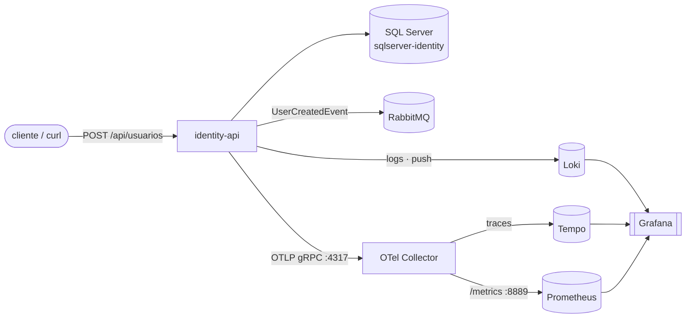

# fcg-ops — orquestração da plataforma FCG

Repositório de **orquestração** da FIAP Cloud Games (FCG): reúne a infraestrutura compartilhada
(RabbitMQ + stack de observabilidade LGTM + OTel Collector) e os artefatos de deploy
(`docker-compose.yml` e manifestos Kubernetes) dos microsserviços. Não contém código de
aplicação — só composição, configuração e orquestração.

A plataforma é **orientada a eventos**: os serviços se comunicam de forma assíncrona via
RabbitMQ em coreografia (sem orquestrador central), publicando e consumindo eventos de domínio.

Esta leva orquestra apenas o serviço **`fcg-identity`** (identidade, autenticação, emissão de
JWT). Os demais serviços (`fcg-catalog`, `fcg-payments`, `fcg-notifications`) entram
**aditivamente** em levas seguintes — os pontos onde eles encaixam já estão marcados (comentados)
no Compose e no `.env.example`.

## Topologia (esta leva)



- **Logs:** o `identity-api` faz push direto no Loki (sink Serilog), com o label `app=fcg-identity`.
- **Traces e métricas:** o `identity-api` exporta os dois pelo mesmo OTLP gRPC para o OTel
  Collector, que roteia **traces → Tempo** e expõe **métricas em `:8889`** para o Prometheus
  fazer scrape.
- **UI única:** o Grafana lê os três backends, permitindo correlação clicável entre logs e traces.

---

## Pré-requisitos

| Ferramenta | Para quê | Como instalar (Windows) |
|---|---|---|
| **Docker Desktop** | Roda os containers (Compose) e dá o backend ao cluster k3d. Inclui o Compose v2 (`docker compose`). | <https://www.docker.com/products/docker-desktop/> |
| **kubectl** | Aplica os manifestos `k8s/`. | Já vem com o Docker Desktop. |
| **k3d** | Sobe o cluster Kubernetes local (k3s em Docker). | `winget install --id k3d.k3d -e --source winget` |
| **PAT do GitHub** com `read:packages` | **Só** para o fluxo `docker compose up --build` (compilar a imagem localmente). O fluxo padrão não precisa. | <https://github.com/settings/tokens> |

Após instalar o k3d, **reabra o terminal** para o PATH atualizar e confirme com `k3d version`.

---

## Subir com Docker Compose

Há dois fluxos. O **pull-GHCR** é o padrão (não precisa de token); o **--build** é para
desenvolvimento com os repositórios clonados lado a lado.

### Passo comum aos dois fluxos

```bash
# 1. variáveis de ambiente (senhas, connection string) — preencha os valores reais
cp .env.example .env

# 2. chave RSA de assinatura JWT — gere o par
bash scripts/gen-rsa-key.sh

# 3. cole a chave privada (PEM) no override não-versionado
cp docker-compose.override.example.yml docker-compose.override.yml
#    edite docker-compose.override.yml e cole o conteúdo de identity-rsa-private.pem
#    no block scalar Jwt__RsaPrivateKeyPem (substituindo o REPLACE_ME).
```

Por que a chave RSA vai no override e não no `.env`: um PEM é multilinha e quebra o parsing do
`.env`. O override usa um block scalar YAML (`|`) e injeta a mesma chave nos dois serviços
(`identity-migrate` e `identity-api`) via âncora. O `docker-compose.override.yml` é carregado
automaticamente pelo Compose junto do `docker-compose.yml` e **não é versionado**.

### Fluxo A — pull-GHCR (padrão, sem token)

Puxa a imagem já publicada `ghcr.io/reinaldogez/fcg-identity:latest`:

```bash
docker compose up
```

### Fluxo B — --build (dev, repositórios irmãos)

Compila o `identity-api` a partir do repositório irmão `../fcg-identity` (precisa estar clonado
ao lado deste). O build faz `dotnet restore` do pacote `Fcg.Contracts` no feed NuGet do GitHub
Packages, que **exige autenticação mesmo para pacote público** — diferente do GHCR de imagens
(fluxo A), que serve a imagem anonimamente. Por isso o build precisa de um token:

```bash
export GH_TOKEN=<PAT com read:packages>   # vale só na sessão atual do shell
docker compose up --build
```

O token é injetado como **BuildKit secret** (`gh_token`): vive apenas na layer de build, é usado
só no `restore` e **não persiste na imagem final**. O repositório guarda apenas o ponteiro do
secret (a env var `GH_TOKEN`); o valor real nunca entra no git.

#### Persistir o `GH_TOKEN` (não redigitar a cada terminal)

O `export` acima vale só na sessão atual. Para gravar o token uma vez no escopo **User** do
Windows — passa a valer em **todo terminal novo** e sobrevive a reinícios, dispensando o
`export` antes de cada `docker compose up --build`:

```powershell
[Environment]::SetEnvironmentVariable("GH_TOKEN", "<PAT com read:packages>", "User")
```

- `"GH_TOKEN"` — nome fixo que o Compose procura (`secrets.gh_token` → `environment: GH_TOKEN`); não altere.
- `"User"` — persiste só para a sua conta, sem admin. (`"Machine"` valeria para todos e exigiria
  admin; `"Process"` valeria só na sessão atual, equivalente ao `$env:GH_TOKEN = "..."`.)

O efeito só aparece em terminais **abertos depois** do comando. Confira com:

```powershell
[Environment]::GetEnvironmentVariable("GH_TOKEN", "User")
```

### Validar o cadastro

Com a stack de pé, o identity responde em `http://localhost:8081`:

```bash
curl -i -X POST http://localhost:8081/api/usuarios \
  -H 'Content-Type: application/json' \
  -d '{ "nome": "Exemplo", "email": "exemplo@fcg.local", "senha": "Exemplo@123456" }'
```

A resposta `201` confirma o cadastro; o `UserCreatedEvent` correspondente aparece publicado na
UI do RabbitMQ (<http://localhost:15672>).

---

## Subir no Kubernetes (k3d)

### 1. Criar o cluster

```bash
bash scripts/bootstrap-k3d.sh
```

Cria o cluster k3d `fcg` (idempotente — se já existir, não recria) e confirma que o `kubectl`
aponta para ele.

### 2. Materializar os Secrets reais

Os manifestos de Secret versionados (`secret.example.yaml`) carregam **apenas placeholders**. O
valor real precisa ser materializado fora do git, uma vez. O caminho recomendado deriva tudo de
uma fonte única (`.env`):

```bash
cp .env.example .env        # preencha os valores reais
bash scripts/init-secrets.sh
```

O `init-secrets.sh` lê o `.env`, gera (ou reaproveita) a chave RSA e escreve os quatro Secrets
reais — `sqlserver-identity/secret.yaml`, `rabbitmq/secret.yaml`, `identity/secret.yaml` e
`identity/secret-jwt.yaml` (com o PEM como block scalar). Esses arquivos `secret.yaml` **não são
versionados**.

<details>
<summary>Alternativa manual (sem o script)</summary>

Para cada componente, copie o template e preencha os placeholders à mão:

```bash
cp k8s/01-infra/sqlserver-identity/secret.example.yaml k8s/01-infra/sqlserver-identity/secret.yaml
cp k8s/01-infra/rabbitmq/secret.example.yaml          k8s/01-infra/rabbitmq/secret.yaml
cp k8s/03-services/identity/secret.example.yaml       k8s/03-services/identity/secret.yaml
cp k8s/03-services/identity/secret-jwt.example.yaml   k8s/03-services/identity/secret-jwt.yaml
# edite cada secret.yaml e substitua os PLACEHOLDER pelos valores reais;
# no secret-jwt.yaml, cole o PEM gerado por scripts/gen-rsa-key.sh no block scalar.
```

Ou, para a chave, sem editar YAML:

```bash
kubectl create secret generic identity-jwt -n fcg \
  --from-file=Jwt__RsaPrivateKeyPem=identity-rsa-private.pem \
  --from-literal=Jwt__KeyId=fcg-identity-key-1
```

</details>

### 3. Aplicar os manifestos

```bash
bash scripts/apply-all.sh
```

O script aplica em ordem de boot — namespace → infra (com `kubectl wait` até os pods ficarem
ready) → observabilidade → serviços, esperando o Job `identity-migrate` concluir
(`kubectl wait --for=condition=complete`) antes de subir o Deployment. Os `*.example.yaml` são
templates e **não** são aplicados.

#### Convenção de Secrets (template versionado / real ignorado)

`secret.example.yaml` é o **template versionado** (só placeholder, documenta o shape);
`secret.yaml` é o **valor real**, ignorado pelo git. Copia-se e preenche-se uma vez (passo 2).
Nenhum segredo real entra no repositório.

#### Aplicar com `kubectl` puro

A forma equivalente, aplicando tudo de uma vez, também funciona:

```bash
kubectl apply -f ./k8s/ -R
```

O `-R` (`--recursive`) percorre as subpastas; o prefixo numérico de topo (`00-`, `01-`, …) faz a
ordem alfabética coincidir com a ordem de dependência. Mesmo que algum recurso seja aplicado
antes da sua dependência, o cluster **converge**: cada pod traz um `initContainer`
(`wait-for-db` / `wait-for-rabbit`) que o segura até a dependência responder. Para um boot
**limpo e ordenado** (sem reinícios transitórios), prefira o `apply-all.sh`. Os `*.example.yaml`
**não** devem ser aplicados por este comando — use o `apply-all.sh`, que já os ignora.

### 4. Acessar os serviços (port-forward)

Todos os Services são `ClusterIP`; o acesso pelo navegador/curl é via `kubectl port-forward`:

```bash
kubectl port-forward svc/grafana       3000:3000   -n fcg   # http://localhost:3000
kubectl port-forward svc/rabbitmq      15672:15672 -n fcg   # http://localhost:15672
kubectl port-forward svc/identity-api  8081:80     -n fcg   # http://localhost:8081
```

Com o identity exposto, o mesmo `curl` da seção de Compose vale (`POST /api/usuarios`).

---

## ⚠️ Visibilidade pública da imagem no GHCR (passo manual, uma vez)

O fluxo pull-GHCR (e o `kubectl apply`, que também puxa a imagem) só funciona para quem não tem
acesso ao repositório se o package estiver **público**. A imagem publicada no GHCR **não** vira
pública automaticamente: é preciso marcá-la à mão nas *settings* do package no GitHub
(Package → Package settings → Change visibility → Public). Sem isso, o pull falha com **401**.

---

## Notas de arquitetura

### Manifestos centralizados (em vez de `/k8s` por serviço)

A convenção usual coloca uma pasta `/k8s` na raiz de cada repositório de serviço. Aqui os manifestos
estão **centralizados** em `fcg-ops/k8s/`. Não é um conflito: `/k8s` por serviço é o **caso
base** — garante que cada serviço seja deployável isoladamente. O repositório de orquestração é
a **camada de orquestração — um cenário opcional dessa convenção**; ao adotá-lo, estamos no caso "com
orquestração", onde a visão única do sistema (e o `kubectl apply` de um único lugar) vive aqui.
Cada serviço continua deployável por si — sua imagem vem do GHCR, independente de onde o YAML mora.

### Escolha de controller por tipo de carga

Cada workload usa o controller que melhor casa com seu ciclo de vida. Nenhum recurso é um `Pod`
avulso — todo Pod nasce sob um controller que cuida de recriação, ordem e escala:

| Carga | Controller | Por quê | Serviços |
|---|---|---|---|
| Com estado | **StatefulSet + PVC** | identidade de rede estável e volume persistente por pod | `sqlserver-identity`, `rabbitmq` |
| Sem estado | **Deployment** | réplicas intercambiáveis; telemetria descartável | `identity-api`, Loki/Tempo/Prometheus/Grafana, OTel Collector |
| Tarefa única | **Job** | roda uma vez até concluir e encerra | `identity-migrate` (migrations do banco) |

Assim o banco e o broker preservam dados entre reinícios (StatefulSet), as aplicações escalam e
se recuperam sozinhas (Deployment), e a migration executa uma vez e sai (Job) — cada Pod sob o
controller correto para o seu papel.

---

## Estrutura do repositório

```
fcg-ops/
├── docker-compose.yml                     # stack local completa (infra + observabilidade + identity)
├── docker-compose.override.example.yml    # template do override de chave RSA (placeholder)
├── .env.example                           # template das variáveis (placeholders)
├── scripts/
│   ├── gen-rsa-key.sh                      # gera o par de chaves RSA
│   ├── bootstrap-k3d.sh                    # cria o cluster k3d 'fcg'
│   ├── init-secrets.sh                     # materializa os Secrets reais a partir do .env
│   └── apply-all.sh                        # aplica os manifestos em ordem de boot
├── observability/                          # configs canônicas (Loki, Tempo, Prometheus, Grafana, OTel)
└── k8s/
    ├── 00-namespace.yaml
    ├── 01-infra/                           # sqlserver-identity, rabbitmq (StatefulSet + PVC)
    ├── 02-observability/                   # loki, tempo, prometheus, grafana, otel-collector
    └── 03-services/identity/               # configmap, secret(s), migrate-job, deployment, service
```
